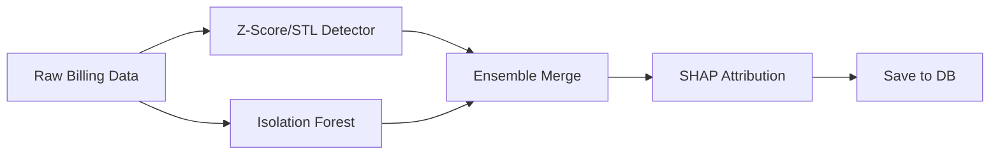
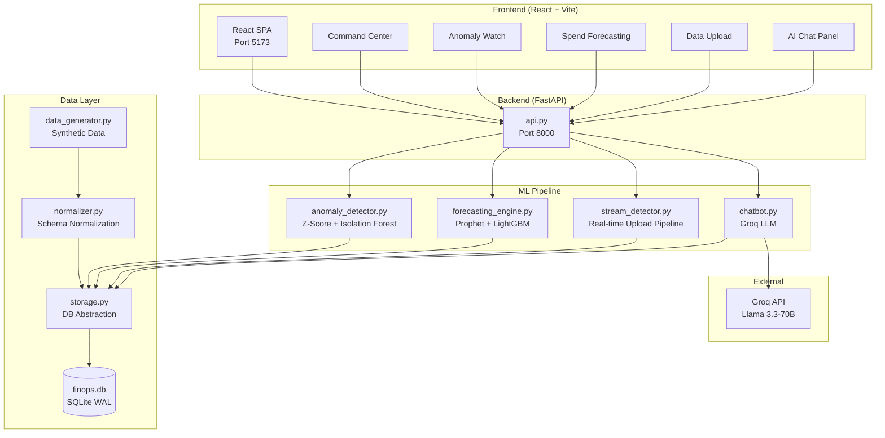
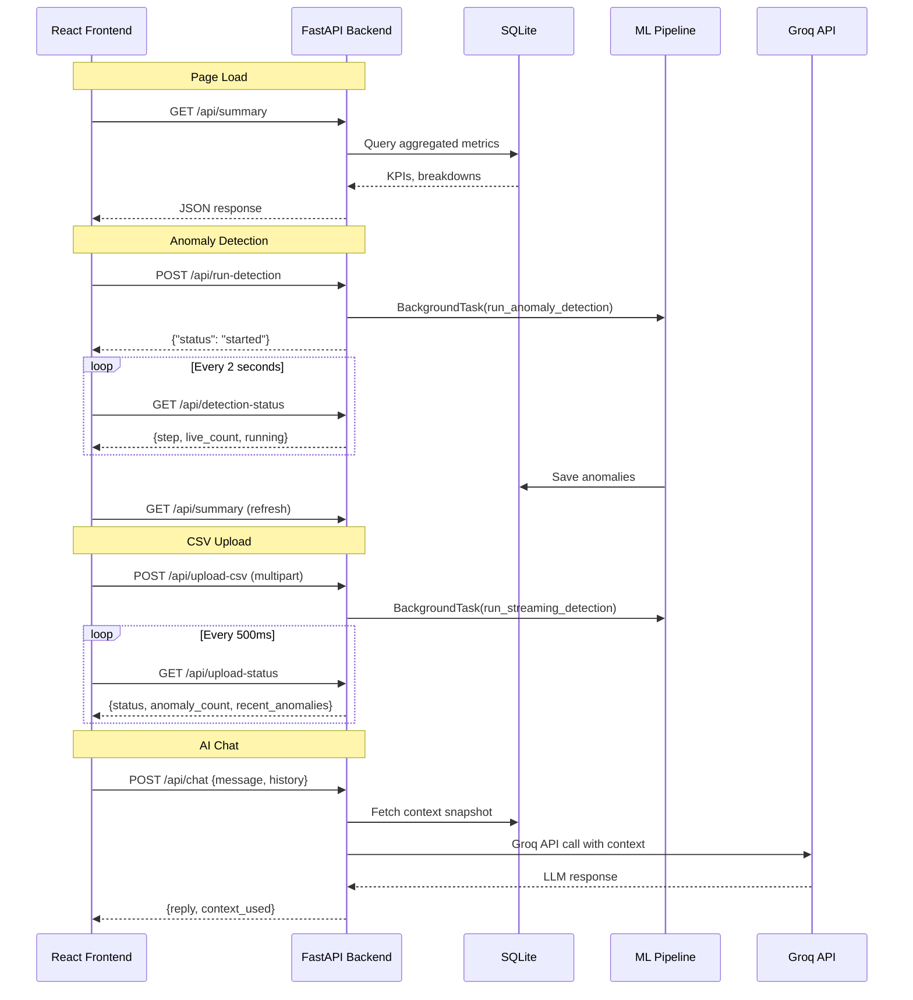
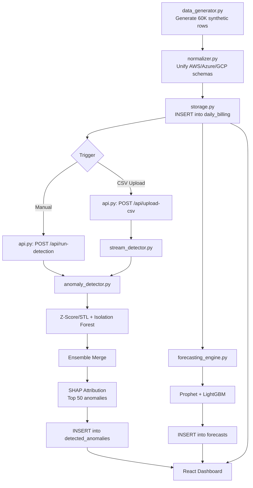

# FinOps Intelligence Platform — Complete Technical Analysis

> [!NOTE]
> This document is an exhaustive, file-by-file technical analysis of the CogniFinOps Intelligence Platform, covering architecture, data pipelines, ML models, API design, frontend components, and end-to-end data flow.

---

## 1. PROJECT OVERVIEW

### What Is This Project?
**CogniFinOps** is a multi-cloud FinOps intelligence platform that ingests, normalizes, analyzes, and forecasts cloud billing data from **AWS, Azure, and GCP**. It provides:
- **Anomaly Detection** — Hybrid Z-score/STL + Isolation Forest ensemble with SHAP root-cause attribution
- **Cost Forecasting** — Probabilistic predictions (p10/p50/p90) via Prophet + LightGBM ensemble
- **Budget Monitoring** — Team-level budget utilization tracking with breach projections
- **AI Chatbot** — Conversational FinOps assistant powered by Groq LLM (Llama 3.3-70B)
- **Real-time CSV Upload** — Streaming anomaly detection with live dashboard updates

### Core Value Proposition
Unify multi-cloud cost data into a single intelligence layer that automatically detects spending anomalies, forecasts future costs, and provides AI-driven optimization recommendations — all through a premium dark-mode dashboard.

### Tech Stack Summary

| Layer | Technologies |
|-------|-------------|
| **Frontend** | React 18, TypeScript, Vite, React Router v6, Recharts, Lucide Icons |
| **Backend API** | Python 3, FastAPI, Uvicorn, Pydantic |
| **ML/AI** | scikit-learn (Isolation Forest), statsmodels (STL), Facebook Prophet, LightGBM, SHAP |
| **LLM** | Groq API → Llama 3.3-70B-Versatile |
| **Data** | pandas, NumPy, SQLite (WAL mode) |
| **Viz (Standalone)** | Plotly (dashboard_generator.py) |
| **Config** | python-dotenv, `.env` files |

---

## 2. PROJECT STRUCTURE

```
FinOps-main/
├── api.py                          # FastAPI backend (1,318 lines) — ALL endpoints
├── anomaly_detector.py             # Z-score/STL + Isolation Forest + SHAP (715 lines)
├── forecasting_engine.py           # Prophet + LightGBM ensemble forecaster (687 lines)
├── chatbot.py                      # Groq LLM chatbot with DB context (375 lines)
├── data_generator.py               # Synthetic multi-cloud billing generator (360 lines)
├── normalizer.py                   # Multi-cloud schema normalizer (289 lines)
├── storage.py                      # SQLite DB layer + schema + queries (444 lines)
├── stream_detector.py              # CSV upload streaming detection (364 lines)
├── dashboard_generator.py          # Standalone Plotly HTML dashboard (475 lines)
├── dashboard_app.py                # Standalone FastAPI + Plotly server (178 lines)
│
├── requirements.txt                # Python dependencies (25 packages)
├── package.json                    # Node.js dependencies
├── vite.config.ts                  # Vite build configuration
├── tsconfig.json                   # TypeScript project references
├── tsconfig.app.json               # TypeScript app compiler options
├── .env.example                    # Environment variable template
├── README.md                       # Frontend setup guide
├── test_finops_dataset.csv         # 40-row test CSV for upload testing
│
├── data/
│   ├── raw/
│   │   └── anomaly_labels.json     # 6 ground-truth anomaly definitions
│   ├── processed/                  # daily_billing.csv (generated output)
│   └── database/                   # finops.db (SQLite runtime database)
│
├── src/                            # React + TypeScript Frontend
│   ├── main.tsx                    # App entry point
│   ├── App.tsx                     # Router configuration (4 routes)
│   ├── App.css                     # Empty (styles in index.css)
│   ├── index.css                   # Global design system (296 lines)
│   │
│   ├── data/
│   │   ├── api.ts                  # API client + all TypeScript types (239 lines)
│   │   └── mockData.ts             # Fallback mock data (55 lines)
│   │
│   ├── types/
│   │   └── index.ts                # Type re-exports + UI constants (62 lines)
│   │
│   ├── pages/
│   │   ├── CommandCenter.tsx       # Main dashboard page (633 lines)
│   │   ├── CommandCenter.module.css
│   │   ├── AnomalyWatch.tsx        # Anomaly detail page (343 lines)
│   │   ├── AnomalyWatch.module.css
│   │   ├── SpendForecasting.tsx    # Forecast page (326 lines)
│   │   ├── SpendForecasting.module.css
│   │   ├── DataUpload.tsx          # CSV upload page (560 lines)
│   │   └── DataUpload.module.css
│   │
│   └── components/
│       ├── Layout/
│       │   ├── Layout.tsx          # Shell: Sidebar + Header + Outlet + AIPanel
│       │   ├── Layout.module.css
│       │   ├── Sidebar.tsx         # Navigation + system status
│       │   ├── Sidebar.module.css
│       │   ├── Header.tsx          # Search bar + notifications + profile
│       │   ├── Header.module.css
│       │   ├── AIPanel.tsx         # AI chatbot side panel (4 tabs)
│       │   └── AIPanel.module.css
│       │
│       └── VisualizationSection/
│           ├── VisualizationSection.tsx  # Deep analytics charts (437 lines)
│           └── VisualizationSection.module.css
│
└── static/
    └── finops_dashboard.html       # Generated Plotly dashboard
```

### Naming Conventions
- **Python**: `snake_case` for files, functions, variables
- **React/TS**: `PascalCase` for components, `camelCase` for variables/functions
- **CSS**: CSS Modules (`*.module.css`) for scoped styling
- **Organization**: Modular monorepo — Python backend at root, React frontend in `src/`

---

## 3. EVERY FILE — IN DETAIL

---

### 📄 [api.py](file:///Users/akshatsingh/Downloads/FinOps-main/api.py) — FastAPI Backend Server (1,318 lines)

**Purpose**: Central API server that orchestrates all backend operations. Handles data retrieval, ML pipeline execution, chatbot queries, and CSV upload streaming.

**Key Components**:

| Function/Endpoint | Method | Purpose |
|---|---|---|
| `lifespan()` | — | App startup: calls `init_db()` to ensure SQLite schema exists |
| `_free_port(port)` | — | Helper to release socket on Windows (handles EADDRINUSE) |
| `GET /api/summary` | GET | Aggregates KPIs: total spend, savings, anomaly count, provider breakdown, department budgets, spend forecast data |
| `GET /api/anomalies` | GET | Paginated anomaly list with severity/provider/team filters, adds `projected_monthly_drift` |
| `GET /api/timeseries` | GET | Daily cost time-series with optional provider/team/service filters |
| `GET /api/forecast` | GET | Returns forecast data (historical + predicted series with p10/p50/p90 bands) |
| `POST /api/run-detection` | POST | Triggers `run_anomaly_detection()` as a `BackgroundTask` |
| `GET /api/detection-status` | GET | Returns current detection pipeline status (step, progress, live count) |
| `POST /api/run-forecast` | POST | Triggers `run_forecasting()` as a `BackgroundTask` |
| `GET /api/budgets` | GET | Returns team budget utilization, status (OK/WARNING/BREACH), projected EOM |
| `POST /api/chat` | POST | Forwards message + history to `chatbot.chat()`, returns AI response |
| `POST /api/upload-csv` | POST | Accepts CSV file, validates, launches `run_streaming_detection()` in background |
| `GET /api/upload-status` | GET | Returns real-time upload/detection progress from `stream_detector` state |
| `POST /api/upload-reset` | POST | Resets upload state machine |
| `GET /api/upload-analytics` | GET | Post-upload analytics: 16 chart datasets + model stats |
| `POST /api/clear-data` | POST | Truncates `daily_billing` and `detected_anomalies` tables |
| `POST /api/save-upload-history` | POST | Persists upload session metadata to `upload_history` table |
| `GET /api/upload-history` | GET | Returns all historical uploads with aggregate statistics |

**Design Decisions**:
- Detection state tracked via module-level dict with `running`/`step`/`live_count` fields
- Background tasks use FastAPI's `BackgroundTasks` (not Celery) — suitable for single-server deployment
- CORS configured with `allow_origins=["*"]` for local development

---

### 📄 [anomaly_detector.py](file:///Users/akshatsingh/Downloads/FinOps-main/anomaly_detector.py) — Anomaly Detection Engine (715 lines)

**Purpose**: Implements a hybrid anomaly detection pipeline using statistical and ML approaches.

**Pipeline Steps**:



**Key Functions**:

| Function | Purpose |
|---|---|
| `run_zscore_detector(df)` | Computes rolling Z-scores per provider×service×team group; uses STL decomposition for seasonal adjustment; flags points with \|z\| > threshold |
| `run_isolation_forest(df)` | Trains Isolation Forest (100 trees, 5% contamination) on encoded features; returns predictions, model, scaler, feature columns |
| `merge_detectors(z_df, if_df)` | Ensemble voting: marks as anomaly if **either** detector flags it; computes `deviation_pct` and `expected_cost` |
| `score_severity(deviation_pct)` | Maps deviation % → CRITICAL (>200%), HIGH (>100%), MEDIUM (>50%), LOW |
| `generate_description(row)` | Creates human-readable anomaly description string |
| `run_shap_on_top(merged, iforest, scaler, feature_cols, X_scaled, top_n=50)` | Computes SHAP values for top-N anomalies using TreeExplainer; gracefully degrades if `shap` not installed |
| `run_anomaly_detection()` | Main orchestrator: loads data → runs both detectors → merges → SHAP → bulk saves to `detected_anomalies` table |

**Detection Logic**:
- **Z-Score**: Groups by `(provider, service, team)`, computes 14-day rolling mean/std, flags \|z\| > 2.5
- **Isolation Forest**: Features = `[cost_usd, day_of_week, day_of_month, is_weekend, cost_log, cost_rolling_7d, cost_rolling_30d, provider_enc, service_enc, team_enc, env_enc, region_enc]`
- **Ensemble**: Union strategy (either detector can flag), not intersection — maximizes recall

---

### 📄 [forecasting_engine.py](file:///Users/akshatsingh/Downloads/FinOps-main/forecasting_engine.py) — Forecasting Engine (687 lines)

**Purpose**: Generates probabilistic cost forecasts using Prophet + LightGBM ensemble.

**Key Functions**:

| Function | Purpose |
|---|---|
| `run_prophet_forecast(df, horizon)` | Fits Prophet model on daily aggregated spend; returns p10/p50/p90 quantile predictions |
| `run_lgbm_forecast(df, horizon)` | Trains LightGBM with "direct" multi-step strategy (one model per horizon step); features include lag values, rolling stats, calendar features |
| `ensemble_forecasts(prophet_fc, lgbm_fc, weights)` | Blends Prophet and LightGBM predictions with configurable weights (default: 0.4/0.6) |
| `run_forecasting(horizons)` | Main pipeline: aggregates daily spend → trains both models → blends → saves to `forecasts` table |

**Design Decisions**:
- **Direct forecasting** for LightGBM (not recursive) to avoid error accumulation
- Prophet handles seasonality/trend, LightGBM captures non-linear patterns
- Default horizons: [7, 30, 90] days
- Weights favor LightGBM (0.6) over Prophet (0.4) based on typical FinOps data characteristics

---

### 📄 [chatbot.py](file:///Users/akshatsingh/Downloads/FinOps-main/chatbot.py) — AI Chatbot (375 lines)

**Purpose**: Provides conversational FinOps insights via Groq LLM API.

**Key Functions**:

| Function | Purpose |
|---|---|
| `_build_context()` | Fetches live database snapshot: total spend, top anomalies, budget status, recent forecasts |
| `_build_system_prompt(context)` | Constructs system prompt injecting current platform state |
| `chat(message, history)` | Main entry: builds context → constructs prompt → calls Groq API → returns response |

**LLM Configuration**:
- **Model**: `llama-3.3-70b-versatile` (via Groq API)
- **Temperature**: 0.7
- **Max tokens**: 1024
- **System prompt**: Includes live spend summaries, anomaly details, budget status

---

### 📄 [data_generator.py](file:///Users/akshatsingh/Downloads/FinOps-main/data_generator.py) — Synthetic Data Generator (360 lines)

**Purpose**: Generates realistic multi-cloud billing data with injected anomalies for testing.

**Data Schema Generated**:
```
date | provider | service | category | team | environment | region | cost_usd
```

**Features**:
- 6 predefined anomaly scenarios from `anomaly_labels.json` (spikes, gradual drifts, correlated events)
- Realistic cost distributions per service (e.g., EC2: $200-400/day, S3: $50-150/day)
- Weekend cost reduction (~30% lower)
- Normal random variation ±15%
- Outputs to `data/processed/daily_billing.csv`

---

### 📄 [normalizer.py](file:///Users/akshatsingh/Downloads/FinOps-main/normalizer.py) — Multi-Cloud Schema Normalizer (289 lines)

**Purpose**: Unifies heterogeneous billing data from AWS, Azure, and GCP into a canonical schema.

**Normalization Pipeline**:

| Input Field (varies by provider) | Canonical Output |
|---|---|
| `UsageDate` / `Date` / `usage_start_time` | `date` (YYYY-MM-DD) |
| `ProductName` / `MeterCategory` / `service.description` | `service` |
| `lineItem/UsageAmount` / `CostInBillingCurrency` / `cost.amount` | `cost_usd` |
| Inferred from service name | `category` (compute/storage/database/network/analytics/ml/other) |

---

### 📄 [storage.py](file:///Users/akshatsingh/Downloads/FinOps-main/storage.py) — Database Layer (444 lines)

**Purpose**: SQLite persistence with WAL mode for concurrent access.

**Tables**:

| Table | Columns | Purpose |
|---|---|---|
| `daily_billing` | date, provider, service, category, team, environment, region, cost_usd | Raw billing records |
| `detected_anomalies` | id, detected_at, date, provider, service, team, environment, cost_usd, expected_cost, deviation_pct, severity, anomaly_type, detector, shap_factors, description | Anomaly results |
| `forecasts` | id, created_at, target_date, horizon, model, p10, p50, p90 | Forecast predictions |
| `budgets` | id, team, period, budget, actual_mtd, utilization_pct, status, projected_eom | Budget tracking |
| `upload_history` | id, filename, uploaded_at, total_rows, total_cost, anomaly_count, savings, detection_rate, providers, severity_breakdown | Upload session metadata |

**Key Functions**: `init_db()`, `get_conn()`, `get_time_series()`, `save_anomalies()`, `get_anomalies()`, `save_forecasts()`, `get_forecasts()`, `get_budget_status()`

---

### 📄 [stream_detector.py](file:///Users/akshatsingh/Downloads/FinOps-main/stream_detector.py) — Streaming Detection (364 lines)

**Purpose**: Handles CSV upload pipeline with real-time anomaly streaming via polling.

**State Machine**:
```
idle → validating → loading → detecting → streaming → complete
                                                    → error
```

**Key Functions**:
- `validate_csv()` — Checks for 8 required columns
- `run_streaming_detection()` — Full pipeline: parse CSV → clear old data → load into DB → run Z-score + IF → save anomalies one-by-one with delay
- `get_upload_state()` / `reset_upload_state()` — Thread-safe state access

**Streaming Effect**: Anomalies are saved one-by-one with adaptive delay (0.05s–0.3s) to create a visible streaming effect in the frontend.

---

### 📄 [dashboard_generator.py](file:///Users/akshatsingh/Downloads/FinOps-main/dashboard_generator.py) — Plotly Dashboard (475 lines)

**Purpose**: Standalone script that generates a self-contained interactive HTML dashboard using Plotly.

**Generates 13 visualizations**: Time-series with anomalies, spend/anomaly bars by provider/service/team/env/region, heatmaps (team×service, region×service), cost distribution histogram, box plots, savings comparison.

---

### 📄 [dashboard_app.py](file:///Users/akshatsingh/Downloads/FinOps-main/dashboard_app.py) — Standalone Dashboard Server (178 lines)

**Purpose**: Alternative FastAPI server that serves the static Plotly dashboard and provides a prediction API endpoint.

**Endpoints**: `GET /` (serve HTML), `GET /api/data` (JSON dashboard data), `POST /api/predict` (upload CSV for prediction)

---

## 4. ARCHITECTURE

### System Architecture



### Frontend ↔ Backend Communication Flow



---

## 5. API DESIGN

### All Endpoints

| Endpoint | Method | Request | Response | Purpose |
|---|---|---|---|---|
| `/api/summary` | GET | — | `SummaryResponse` | Dashboard KPIs |
| `/api/anomalies` | GET | `?severity=&provider=&team=&limit=&offset=` | `AnomaliesResponse` | Paginated anomaly list |
| `/api/timeseries` | GET | `?provider=&team=&service=` | `{data: TimePoint[]}` | Daily cost series |
| `/api/forecast` | GET | `?horizon=30&model=ensemble&provider=&team=` | `ForecastResponse` | Forecast with p10/p50/p90 |
| `/api/budgets` | GET | `?team=` | `{items: BudgetItem[]}` | Budget utilization |
| `/api/run-detection` | POST | — | `{status, message}` | Trigger anomaly pipeline |
| `/api/detection-status` | GET | — | `DetectionStatus` | Pipeline progress |
| `/api/run-forecast` | POST | — | `{status, message}` | Trigger forecast pipeline |
| `/api/chat` | POST | `{message, history[]}` | `{reply, context_used}` | AI chatbot |
| `/api/upload-csv` | POST | `multipart/form-data` | `{status, filename, total_rows}` | Upload CSV |
| `/api/upload-status` | GET | — | `UploadStatus` | Upload progress |
| `/api/upload-reset` | POST | — | `{status, message}` | Reset upload state |
| `/api/upload-analytics` | GET | — | `UploadAnalytics` (16 datasets) | Post-upload analytics |
| `/api/clear-data` | POST | — | `{status, message}` | Truncate all data |
| `/api/save-upload-history` | POST | — | `{status, filename}` | Persist upload session |
| `/api/upload-history` | GET | — | `UploadHistoryResponse` | Historical uploads |

---

## 6. DATA PIPELINE

### End-to-End Data Flow



### Data Schema (Canonical)

```sql
-- daily_billing
CREATE TABLE daily_billing (
    date         TEXT,      -- YYYY-MM-DD
    provider     TEXT,      -- aws | azure | gcp
    service      TEXT,      -- e.g., "EC2", "Virtual Machines"
    category     TEXT,      -- compute | storage | database | network | analytics | ml | other
    team         TEXT,      -- e.g., "platform", "ml-team", "data-eng"
    environment  TEXT,      -- production | staging | development
    region       TEXT,      -- e.g., "us-east", "eu-west"
    cost_usd     REAL       -- Daily cost in USD
);

-- detected_anomalies
CREATE TABLE detected_anomalies (
    id              INTEGER PRIMARY KEY AUTOINCREMENT,
    detected_at     TEXT,
    date            TEXT,
    provider        TEXT,
    service         TEXT,
    team            TEXT,
    environment     TEXT,
    cost_usd        REAL,
    expected_cost   REAL,
    deviation_pct   REAL,
    severity        TEXT,   -- CRITICAL | HIGH | MEDIUM | LOW
    anomaly_type    TEXT,   -- cost_spike | cost_drop
    detector        TEXT,   -- zscore | isolation_forest | ensemble
    shap_factors    TEXT,   -- JSON: {"feature": shap_value, ...}
    description     TEXT
);
```

---

## 7. ML/AI MODELS — DEEP DIVE

### Anomaly Detection: Hybrid Ensemble

#### Model 1: Z-Score + STL Decomposition

| Parameter | Value |
|---|---|
| Rolling window | 14 days |
| Z-score threshold | 2.5 |
| Grouping | `(provider, service, team)` |
| Seasonality | STL extracted (period=7 for weekly) |

**Process**: For each group, compute rolling mean/std → calculate z-score → flag if \|z\| > 2.5 → subtract seasonal component for detrended scoring.

#### Model 2: Isolation Forest

| Parameter | Value |
|---|---|
| `n_estimators` | 100 |
| `contamination` | 0.05 (5%) |
| `random_state` | 42 |
| `n_jobs` | -1 (all cores) |

**Feature Engineering**:
```python
features = [
    "cost_usd",           # Raw cost
    "day_of_week",        # 0-6
    "day_of_month",       # 1-31
    "is_weekend",         # Binary
    "cost_log",           # log1p(cost)
    "cost_rolling_7d",    # 7-day rolling mean
    "cost_rolling_30d",   # 30-day rolling mean
    "provider_enc",       # Label encoded
    "service_enc",        # Label encoded
    "team_enc",           # Label encoded
    "env_enc",            # Label encoded
    "region_enc",         # Label encoded
]
```

#### Ensemble Merge Strategy
- **Union voting**: Anomaly if flagged by Z-score **OR** Isolation Forest
- Computes: `deviation_pct = ((actual - expected) / expected) * 100`
- Assigns severity: CRITICAL (>200%), HIGH (>100%), MEDIUM (>50%), LOW (else)

#### SHAP Root Cause Attribution
- Applied to top 50 anomalies (by deviation)
- Uses `shap.TreeExplainer(iforest_model)`
- Graceful fallback if `shap` library not installed (empty factors)
- Stored as JSON in `shap_factors` column

### Forecasting: Prophet + LightGBM Ensemble

#### Prophet Model
| Parameter | Value |
|---|---|
| Seasonality | Weekly (auto), yearly (auto) |
| Changepoint prior | 0.05 |
| Quantiles | [0.1, 0.5, 0.9] |

#### LightGBM Model
| Parameter | Value |
|---|---|
| Strategy | Direct multi-step |
| Objective | `quantile` (separate model per quantile) |
| Features | 15 lag/calendar features |
| n_estimators | 200 |
| learning_rate | 0.05 |
| max_depth | 6 |

**LightGBM Features**:
```python
features = [
    "lag_1", "lag_7", "lag_14", "lag_30",
    "rolling_mean_7", "rolling_mean_14", "rolling_mean_30",
    "rolling_std_7", "rolling_std_14",
    "day_of_week", "day_of_month", "month",
    "is_weekend", "is_month_start", "is_month_end",
]
```

#### Ensemble Blending
```python
p50 = prophet_weight * prophet_p50 + lgbm_weight * lgbm_p50
# Default: prophet_weight=0.4, lgbm_weight=0.6
```

---

## 8. FRONTEND — COMPLETE COMPONENT BREAKDOWN

### Design System ([index.css](file:///Users/akshatsingh/Downloads/FinOps-main/src/index.css))

**Color Palette**: Dark theme with cyan (#06B6D4) as primary, violet (#8B5CF6) as secondary, amber (#F59E0B) as tertiary. Alert red (#EF4444) for anomalies, emerald (#10B981) for success.

**Typography**: Inter (body), Outfit (headings), JetBrains Mono (code/numbers).

**8 keyframe animations**: `spin`, `fadeInUp`, `fadeInScale`, `shimmer`, `pulse-ring`, `bar-grow`, `float`, `glow-border`.

### Routing ([App.tsx](file:///Users/akshatsingh/Downloads/FinOps-main/src/App.tsx))

| Path | Component | Purpose |
|---|---|---|
| `/` | `CommandCenter` | Main dashboard with KPIs, pipeline, charts |
| `/anomaly-watch` | `AnomalyWatch` | Anomaly detail with root cause viz |
| `/budget-forecast` | `SpendForecasting` | Forecast charts + budget status |
| `/data-upload` | `DataUpload` | CSV upload with live streaming |

All routes wrapped in `<Layout>` (Sidebar + Header + AIPanel).

### Component Details

#### [Layout.tsx](file:///Users/akshatsingh/Downloads/FinOps-main/src/components/Layout/Layout.tsx) — Shell Component
Three-column layout: Sidebar (left) | Main Content (center) | AI Panel (right). Uses `<Outlet>` for page content.

#### [Sidebar.tsx](file:///Users/akshatsingh/Downloads/FinOps-main/src/components/Layout/Sidebar.tsx) — Navigation
- Logo: "CogniFinOps Intelligence Platform" with Zap icon
- 4 nav items with `NavLink` active state styling
- System status panel: API Server (LIVE), ML Engine (READY), Data Sync (5m ago)
- Icons from Lucide React

#### [Header.tsx](file:///Users/akshatsingh/Downloads/FinOps-main/src/components/Layout/Header.tsx) — Top Bar
- Search bar with ⌘K keyboard hint
- Live pulse indicator
- **Notification bell**: Fetches latest 5 anomalies via `api.anomalies({limit: 5})`; shows severity-colored dots, time-since badges, and links to Anomaly Watch
- **Profile dropdown**: Avatar from ui-avatars.com, profile menu (My Profile, Settings, Security, Usage & Billing, Sign Out)

#### [AIPanel.tsx](file:///Users/akshatsingh/Downloads/FinOps-main/src/components/Layout/AIPanel.tsx) — AI Chatbot
- **4 Tabs**: CHAT (conversation), LOG (history), ROOT (root cause prompts), SIM (what-if scenarios)
- **Quick prompts**: 4 pre-built questions (cost spikes, budget overruns, reserved instances, forecasts)
- **Markdown rendering**: Bold, lists, and h2/h3 headers in AI responses
- **Collapsible**: Can shrink to 38px wide icon strip
- **Chat flow**: User message → `api.chat()` → typing indicator → AI response bubble

#### [CommandCenter.tsx](file:///Users/akshatsingh/Downloads/FinOps-main/src/pages/CommandCenter.tsx) — Main Dashboard (633 lines)
- **3 KPI cards**: Total Spend (MTD), Savings Opportunities, Active Anomalies
- **Detection pipeline visualization**: 5-step timeline with progress bar, live count, animated status
- **Upload history section**: Aggregate totals + individual file cards with stats
- **Bottom grid**: Spend Forecast bar chart (Recharts), Department Budget progress bars, Provider Distribution pie chart
- **Actions**: Refresh, Clear Data, Re-run Detection

#### [AnomalyWatch.tsx](file:///Users/akshatsingh/Downloads/FinOps-main/src/pages/AnomalyWatch.tsx) — Anomaly Detail (343 lines)
- **Hero card**: Severity badge with dynamic color, service/team title, description, 4 stat boxes (Projected Drift, Detected Delta, Provider, Action Priority)
- **Filter bar**: ALL/CRITICAL/HIGH/MEDIUM/LOW chips with count
- **Root Cause Visualization**: Connected node graph (Provider → Service → Anomaly Core) + SHAP factor bars
- **Anomaly list**: Clickable cards with severity tag, deviation %, cost

#### [SpendForecasting.tsx](file:///Users/akshatsingh/Downloads/FinOps-main/src/pages/SpendForecasting.tsx) — Forecast Page (326 lines)
- **Horizon selector**: 7/30/90-day toggle buttons
- **Main chart**: AreaChart with actual (cyan), P50 forecast (dashed), P90 band (violet gradient), NOW reference line
- **AI Observation**: Dynamic text based on breach risks and projected spend
- **Budget status grid**: Team-by-team progress bars with utilization %, WARNING/BREACH tags
- **Forecast events**: Breach risk predictions per team

#### [DataUpload.tsx](file:///Users/akshatsingh/Downloads/FinOps-main/src/pages/DataUpload.tsx) — Upload Page (560 lines)
- **Drag & drop zone**: File upload with required column validation
- **Real-time pipeline progress**: Progress bar, status badge, stats (rows, progress %, timestamps)
- **Counter cards**: Anomalies (pulsing animation), Records, Detection Rate
- **Live anomaly feed**: Table updated every 500ms with severity, service, team, cost, deviation, date
- **Post-upload analytics**: Model overview cards (Z-Score+STL, Isolation Forest, Ensemble), key metrics row, 6 chart cards (cost trend, provider distribution, severity, service breakdown, team spend, detector contribution), top anomalies table
- **Deep visualization**: Delegates to `VisualizationSection` component
- **Completion card**: Toggle to apply results to dashboard, navigation buttons

#### [VisualizationSection.tsx](file:///Users/akshatsingh/Downloads/FinOps-main/src/components/VisualizationSection/VisualizationSection.tsx) — Deep Analytics (437 lines)
8 visualization categories:
1. **Time-series** with anomaly points + 7-day rolling average (ComposedChart)
2. **Spend distribution** by provider, environment, team, region (4 bar charts)
3. **Service spend** full-width bar chart (top 8)
4. **Anomaly counts** by provider, team, service, region (4 bar charts)
5. **Box plot proxy** for cost by provider + severity distribution
6. **Stacked bar** for provider × service anomaly breakdown
7. **Budget forecast** actual vs predicted (2 line/area charts)
8. **Detailed anomaly table** with 12 columns

---

## 9. CONFIGURATION

### Environment Variables (`.env.example`)

| Variable | Default | Purpose |
|---|---|---|
| `GROQ_API_KEY` | (required) | API key for Groq LLM service |
| `GROQ_MODEL` | `llama-3.3-70b-versatile` | LLM model identifier |
| `API_HOST` | `0.0.0.0` | FastAPI bind host |
| `API_PORT` | `8000` | FastAPI bind port |
| `VITE_API_URL` | `http://localhost:8000` | Frontend API base URL |

### Python Dependencies ([requirements.txt](file:///Users/akshatsingh/Downloads/FinOps-main/requirements.txt))

```
pandas, numpy, scikit-learn, statsmodels, prophet, lightgbm,
fastapi, uvicorn, pydantic, python-dotenv, groq,
plotly, shap (optional)
```

### Node Dependencies ([package.json](file:///Users/akshatsingh/Downloads/FinOps-main/package.json))

```
react, react-dom, react-router-dom, recharts, lucide-react
@vitejs/plugin-react, typescript, vite, eslint
```

---

## 10. GROUND-TRUTH ANOMALIES

The file [anomaly_labels.json](file:///Users/akshatsingh/Downloads/FinOps-main/data/raw/anomaly_labels.json) contains 6 pre-defined anomaly scenarios injected by the data generator:

| ID | Provider | Type | Service | Multiplier | Description |
|---|---|---|---|---|---|
| ANO-001 | AWS | Spike | EC2 | 4.8× | Autoscaling loop from failed health check |
| ANO-002 | AWS | Gradual drift | S3 | 3.2× | Backup job storing duplicates |
| ANO-003 | Azure | Spike | Virtual Machines | 3.1× | Dev VMs not shut down over weekend |
| ANO-004 | Azure | Correlated | Bandwidth | 5.5× | Public bucket exposure causing egress spike |
| ANO-005 | GCP | Spike | BigQuery | 6.2× | Runaway scan without partition filter |
| ANO-006 | GCP | Gradual drift | Kubernetes Engine | 2.4× | Node pool not autoscaling down after load test |

---

## 11. KEY DESIGN DECISIONS

| Decision | Rationale |
|---|---|
| **SQLite with WAL** | Simple single-file DB with concurrent read support; no need for PostgreSQL at this scale |
| **Union ensemble voting** | Maximizes anomaly recall at the cost of some precision; acceptable for alerting use cases |
| **Direct multi-step forecasting** | Avoids recursive error accumulation in LightGBM predictions |
| **Background tasks (not Celery)** | Single-server deployment doesn't need distributed task queues |
| **CSS Modules** | Scoped styling prevents class name collisions across components |
| **Streaming via polling** | Simpler than WebSockets; 500ms interval provides near-real-time UX |
| **SHAP as optional** | Graceful degradation if the heavy `shap` library isn't installed |
| **`_free_port` helper** | Windows-specific socket locking workaround for development |

---

## 12. POTENTIAL IMPROVEMENTS

| Area | Suggestion |
|---|---|
| **Storage** | Add chat history persistence to DB |
| **Forecasting** | Hyperparameter tuning for LightGBM (e.g., Optuna) |
| **Real-time** | Replace polling with WebSocket/SSE for upload streaming |
| **Auth** | Add JWT authentication to API endpoints |
| **Testing** | Add unit tests for ML pipeline and API endpoints |
| **Deployment** | Containerize with Docker; add CI/CD pipeline |
| **Multi-user** | Replace module-level state dicts with proper session management |
| **Data** | Support Parquet/JSON input formats alongside CSV |
